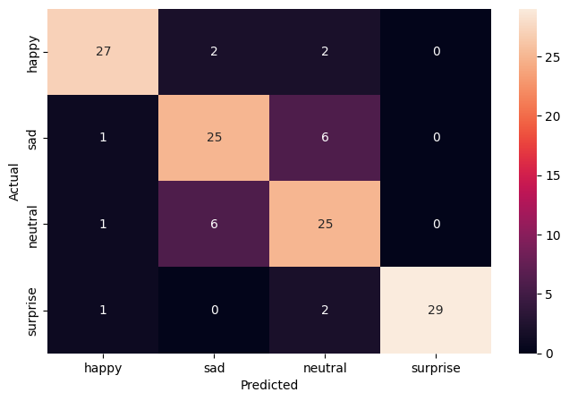

# 😃 Facial Emotion Detection with Deep Learning

## 📌 Problem and Solution Summary

### **Problem**
Communication has always been at the core of human progress, and much of it is non-verbal — research suggests that **55% is non-verbal, 38% vocal, and only 7% words** *(Mehrabian, 1981)*.  
As human-computer interaction evolves, Our ability to communicate with computers also needs to evolve, and with the help of data science, we can enable more complete virtual communication. 

Facial emotion detection has numerous applications:
- **Healthcare** – Detecting emotional cues related to mental health.
- **Human-Computer Interaction** – More adaptive user interfaces.
- **Marketing** – Understanding audience reactions in real time.
- **Security** – Monitoring emotional states in critical situations.

This project focuses on detecting **four basic emotions**:  
`Sad` • `Happy` • `Neutral` • `Surprised`

We use a **pre-classified grayscale dataset** to train and evaluate a deep learning model capable of real-time predictions.

---

### **Proposed Solution**
We developed a **custom Convolutional Neural Network (CNN)** optimized for this specific task.  
The model achieves:
- **Accuracy**: 0.83
- **Macro F1-score**: 0.84 (balanced performance across classes)
- **Near-perfect recall** for the "Surprised" category.
- **Speed**: ~2.3 milliseconds per prediction.

              precision    recall  f1-score   support

           0       0.90      0.87      0.89        31
           1       0.76      0.78      0.77        32
           2       0.71      0.78      0.75        32
           3       1.00      0.91      0.95        32

    accuracy                           0.83       127
   macro avg       0.84      0.83      0.84       127
weighted avg       0.84      0.83      0.84       127

To further improve performance for `Sad` and `Neutral` emotions, **data augmentation** is recommended.

---

### **Business Impact**
This solution provides a **first-step, lightweight, and cost-effective approach** for integrating emotion detection into customer-facing applications.  

**Use cases include:**
- **Customer Experience** – Adapting UI or service based on detected emotions.
- **Marketing Optimization** – Measuring emotional response to ads or products.
- **Healthcare Monitoring** – Providing additional emotional context for diagnoses.

---

## 💡 Recommendations for Implementation

### **For Technical Deployment**
- Use **black-and-white cameras** to match training data and reduce noise.
- Integrate the model with **OpenCV** for real-time inference.
- Ensure **face is centered and well-lit** for accurate detection.

### **For Business Stakeholders**
- Develop real-time software to integrate with the model.
- Collect emotional reaction data to guide marketing and service improvements.
- Expand the dataset to include more emotions and diverse subjects.
- Plan future model updates to capture microexpressions and a wider emotional range.

---

## 📈 Expected Benefits & Costs

**Benefits:**
- **Real-time emotional feedback** for targeted marketing.
- Increased conversion rates from emotionally-responsive ads.
- Reduced marketing spend through better targeting.
- Enhanced customer satisfaction through adaptive interaction.

**Example Scenario:**
- Monthly ad budget: **$10,000**
- Conversion rate without emotion detection: **2%**
- Conversion rate with emotion-responsive targeting: **3%**
- Profit per conversion: **$50**
- Implementation cost: **$300/month** (cloud + maintenance)

A 1% conversion rate increase could result in **+$5,000/month** in revenue.

---

## ⚠️ Risks & Challenges
- Limited to the four trained emotion categories.
- Model trained on grayscale images — performance may drop with color input.
- Risk of misclassification for emotions outside the trained set.

---

## 🔮 Future Work
- Expand dataset with more emotions and microexpressions.
- Explore **color-based approaches** and **transfer learning** with pretrained models.
- Develop cross-domain applications (healthcare, education, entertainment).
- Implement edge-optimized versions for mobile and IoT devices.

---

## 🛠️ Tech Stack
- **Python**
- **TensorFlow / Keras**
- **OpenCV**
- **NumPy / Pandas / Matplotlib**
- **Jupyter Notebook**

---

## 📂 Project Structure
├── Capstone.ipynb # Main notebook with training and evaluation
├── sample_data/ # Small example dataset
├── requirements.txt # Dependencies
└── README.md # Documentation

---

## 📥 Dataset
- **Sample dataset** included in `sample_data/` for quick testing.
- Adjust dataset path in `Capstone.ipynb` before running.

---

## 👤 Author
**Patricio Galván Ledo**  
[LinkedIn](https://www.linkedin.com/in/patricio-galvan-ledo) • [Portfolio](https://www.mygreatlearning.com/eportfolio/patricio-galvan-ledo)

---